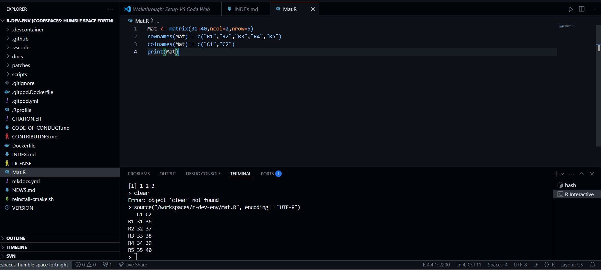

# EasyTest - Running R in GitHub Codespaces

## 🚀 Setting Up GitHub Codespace

1. **Go to the R Dev Container Repository**  
   Navigate to the repository on GitHub.

2. **Start a GitHub Codespace**  
   - Click the **"Code"** button (green dropdown at the top right).
   - Select the **"Codespaces"** tab.
   - Click **"Create codespace"**.
   - Wait a few minutes for the Codespace to initialize.

## 🖥️ Writing and Running R Code

1. **Create a New R Script**  
   - Inside VS Code (Codespaces), create a new file with a `.R` extension.

2. **Attach R Terminal**  
   - Look at the bottom VS Code **footer**.  
   - Click on **"R (not attached)"** and select an active R session.

3. **Write and Run R Code**  
   - Open your new `.R` file and type a R command.

## Test

The following code make a matrix Mat and print its value. Below is the the code for Test:

```markdown
```r
Mat <- matrix(31:40,ncol=2,nrow=5)
rownames(Mat) = c("R1","R2","R3","R4","R5")
colnames(Mat) = c("C1","C2")
print(Mat)
```

Here is the screenshot of R session required for First Test

